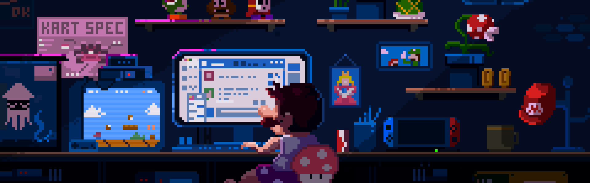

  

<h1 align="center">Hi 👋, I'm Yashwanth G</h1>
<h3 align="center">Software Developer | Turning ideas into practical solutions</h3>

  

### 👨‍💻 About Me:
- 🌱 I'm currently learning **ReactJs, AI/ML**
- 👯 I'm looking to collaborate on **Open Source Projects**
- 💬 Ask me about **React, Node.js and Web Development**
- 📫 Reach me at: **yash59109845@gmail.com**

---

### 🌐 Connect with me:

### 🛠 Languages and Tools:

  

### 📊 GitHub Stats:

  
    
  
    
  

⭐ <i>Always learning. Always building. Always improving.</i>

